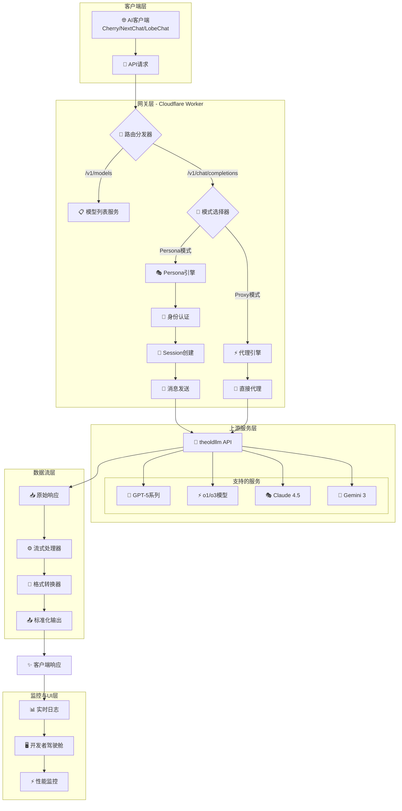
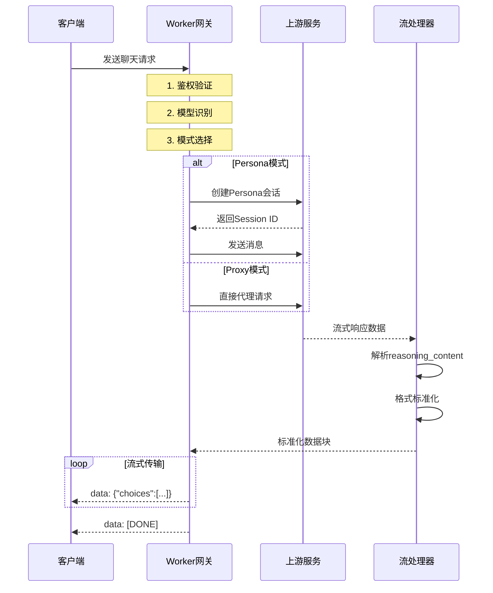

# 🚀 theoldllm-2api-pro (终极绝对零度版)

### 🌌 代号：缟玛瑙 - 最终协议

[](https://opensource.org/licenses/Apache-2.0)
[]()
[]()
[]()
[]()
[]()

> **"在代码的荒原上，我们不仅复刻协议，更在重塑连接的艺术。"** —— 首席AI执行官
> 本项目改自 https://github.com/lza6/theoldllm-2api-cfwork

---

## 🌟 核心愿景与哲学

**theoldllm-2api-pro** 不仅仅是一个简单的API转换器——它是一个基于**奇美拉协议(Chimera Protocol)**的终极复刻工程，致力于打破闭源模型与开源生态之间的无形壁垒。

### 🧭 核心价值观
- **透明与开放**：我们坚信技术应当是透明且易于触达的
- **共建与共享**：开源不是施舍，而是智慧的共创与传承
- **技术民主化**：让最先进的语言模型能力惠及每一位开发者

### 🎯 你将获得什么？
通过部署和使用本项目，你不仅将获得一个强大的全模型API网关，更将深入理解：
- 流式传输的底层实现原理
- 身份伪装与路由分发的工程实践
- 复杂协议转换的设计哲学

**相信我，你来你也行！💪**

---

## 🏆 核心特性概览

| 特性 | 描述 | 状态 |
|------|------|------|
| 🎯 **OpenAI全兼容** | 1:1适配标准接口，无缝接入主流AI客户端 | ✅ 已实现 |
| 🧠 **思维链可视化** | 支持`reasoning_content`实时流式渲染 | ✅ 已实现 |
| 🔀 **智能路由分发** | 双模引擎自动选择最佳路径 | ✅ 已实现 |
| 🛡️ **高级指纹伪装** | Chrome 143最新指纹，绕过风控 | ✅ 已实现 |
| 💻 **一体化驾驶舱** | 内置Web UI，支持实时调试与监控 | ✅ 已实现 |
| 🌐 **全球边缘部署** | 基于Cloudflare Workers，超低延迟 | ✅ 已实现 |

---

## 🏗️ 技术架构深度解析

### 📊 系统架构图



### 🔧 核心技术栈

| 技术组件 | 版本/实现 | 作用 |
|---------|-----------|------|
| **运行环境** | Cloudflare Workers | 全球边缘计算平台 |
| **传输协议** | Server-Sent Events | 实时流式传输 |
| **加密算法** | 自定义异或算法 | Token安全保护 |
| **路由引擎** | 双模智能分发 | 自动选择最优路径 |
| **前端框架** | 原生HTML/CSS/JS | 轻量级管理界面 |
| **构建工具** | Wrangler CLI | 一键部署 |

### ⚡ 请求处理流程图



---

## 🚀 快速开始指南

### 🎯 一键部署方案（推荐）

<div align="center">

[](https://dash.cloudflare.com/?to=/:account/workers-and-pages)
[](https://theoldllm-api.wilsons.workers.dev/)

</div>

#### 部署步骤：

1. **访问Cloudflare控制台**
   - 登录 [Cloudflare Dashboard](https://dash.cloudflare.com/)
   - 导航至 **Workers & Pages** → **Create application**

2. **创建Worker**
   ```bash
   ⚡ 新建Worker → 选择"HTTP Handler"
   📝 名称: theoldllm-api (或自定义)
   🔧 运行时: JavaScript
   ```

3. **复制代码**
   - 点击 **Quick edit**
   - 清空默认代码
   - 粘贴本项目完整的 `index.js` 内容

4. **配置环境变量**
   ```javascript
   // 在wrangler.toml中添加（可选）
   [vars]
   API_MASTER_KEY = "your-secure-key"
   ```

5. **部署与验证**
   ```bash
   ✅ 点击 "Save and Deploy"
   🔍 访问: https://my-onyx-api.you.workers.dev
   🎉 看到驾驶舱界面即成功！
   ```

### 🛠️ 开发者CLI部署

```bash
# 1. 安装Wrangler CLI
npm install -g wrangler

# 2. 登录Cloudflare
wrangler login

# 3. 创建新项目
wrangler generate theoldllm-api https://github.com/lza6/theoldllm-2api-cfwork

# 4. 进入目录并部署
cd my-onyx-api
wrangler deploy

# 5. 自定义配置（可选）
echo 'API_MASTER_KEY="your-custom-key"' >> .dev.vars
```

---

## ⚙️ 配置详解

### 🔐 核心配置参数

```javascript
// 位于代码顶部的CONFIG对象
const CONFIG = {
  // 🔑 安全配置
  API_MASTER_KEY: "your-secure-password", // 必须修改！
  
  // 🌐 上游服务配置
  UPSTREAM_ORIGIN: "https://theoldllm.vercel.app",
  
  // 🔄 重试策略
  RETRY_LIMIT: 2, // 失败重试次数
  
  // 🧠 模型配置（可自定义扩展）
  MODELS: [
    // 格式: {id, persona_id, type, tokens, name}
    {id: "gpt-5.2", persona_id: 2064, type: 0, tokens: 398976, name: "GPT-5.2 (Experimental)"},
    // ... 更多模型
  ]
};
```

### 📋 环境变量配置

| 变量名 | 必需 | 默认值 | 说明 |
|--------|------|--------|------|
| `API_MASTER_KEY` | ✅ | `1` | API主密钥，强烈建议修改 |
| `TENANT_TOKEN` | ❌ | (内置) | 上游租户令牌，可覆盖 |
| `DECRYPT_KEY` | ❌ | (内置) | 解密密钥，一般无需修改 |

---

## 🎮 开发者驾驶舱使用指南

### 🖥️ 驾驶舱界面概览

```
┌─────────────────────────────────────────────────────────────┐
│  🚀 theoldllm-2api-pro - 开发者驾驶舱 v1.6.1                │
├─────────────────────────────────────────────────────────────┤
│  🎯 API端点: https://your-worker.workers.dev/v1             │
│  🔑 API密钥: ••••••••••••••••••••                          │
│  📊 状态: ● 活跃                                            │
├─────────────────────────────────────────────────────────────┤
│  🧠 模型选择: [GPT-5.2 (Experimental) ▼]                    │
│  📝 上下文: 399k tokens                                    │
├─────────────────────────────────────────────────────────────┤
│  💬 聊天终端:                                              │
│  ┌─────────────────────────────────────────────────────┐   │
│  │ User: 你好，世界！                                   │   │
│  │ AI: 你好！我是AI助手...                             │   │
│  │   <think>思考过程可视化...</think>                 │   │
│  └─────────────────────────────────────────────────────┘   │
├─────────────────────────────────────────────────────────────┤
│  📊 系统日志: [17:30:45] [REQUEST] 模型: gpt-5.2          │
│           [17:30:46] [DEBUG] 正在激活模型配置...           │
│           [17:30:47] [SUCCESS] 响应完成                   │
└─────────────────────────────────────────────────────────────┘
```

### 🔍 功能亮点

1. **🎯 一键复制API信息** - 点击地址/密钥框自动复制到剪贴板
2. **🧠 实时思维链渲染** - 特殊思考过程使用`<think>`标签高亮显示
3. **📊 请求日志追踪** - 详细记录每个请求的处理状态
4. **⚡ 快捷发送** - Ctrl+Enter快速发送消息
5. **🔧 模型实时切换** - 下拉菜单选择不同模型，即时生效

---

## 📚 API接口文档

### 🔌 基础端点

```http
GET /v1/models
```
**响应示例：**
```json
{
  "object": "list",
  "data": [
    {
      "id": "gpt-5.2",
      "object": "model",
      "created": 1735324800,
      "owned_by": "theoldllm",
      "context_window": 398976
    }
  ]
}
```

### 💬 聊天补全接口

```http
POST /v1/chat/completions
Authorization: Bearer your-api-key
Content-Type: application/json

{
  "model": "gpt-5.2",
  "messages": [
    {"role": "user", "content": "你好"}
  ],
  "stream": true,
  "temperature": 0.7,
  "max_tokens": 1000
}
```

**流式响应示例：**
```text
data: {"id":"onyx-xxx","object":"chat.completion.chunk","choices":[{"delta":{"content":"你好"},"index":0}]}
data: {"id":"onyx-xxx","object":"chat.completion.chunk","choices":[{"delta":{"content":"！"},"index":0}]}
data: [DONE]
```

### 🔧 高级参数

| 参数 | 类型 | 必需 | 默认值 | 说明 |
|------|------|------|--------|------|
| `model` | string | ✅ | - | 模型ID，从`/v1/models`获取 |
| `messages` | array | ✅ | - | 消息历史数组 |
| `stream` | boolean | ❌ | false | 是否启用流式响应 |
| `temperature` | number | ❌ | 0.7 | 温度参数(0-2) |
| `max_tokens` | integer | ❌ | null | 最大生成token数 |
| `is_web_ui` | boolean | ❌ | false | Web UI调试模式 |

---

## 🧪 客户端兼容性测试

### ✅ 已验证兼容的客户端

| 客户端 | 版本 | 状态 | 备注 |
|--------|------|------|------|
| **Cherry Studio** | v2.5+ | ✅ 完美兼容 | 自动识别模型列表 |
| **NextChat** | v1.20+ | ✅ 完美兼容 | 支持流式与思维链 |
| **LobeChat** | v1.10+ | ✅ 完美兼容 | 需要配置自定义API |
| **OpenCat** | v3.2+ | ✅ 兼容 | 需手动输入API端点 |
| **ChatBox** | v1.9+ | ✅ 兼容 | 支持SSE流式 |
| **AnythingLLM** | v0.12+ | ✅ 兼容 | 需启用流式响应 |

### 🔧 客户端配置示例

#### NextChat配置：
```yaml
# 配置自定义模型提供商
- id: "theoldllm"
  name: "TheOldLLM Gateway"
  enabled: true
  endpoints:
    chat: "https://your-worker.workers.dev/v1/chat/completions"
    models: "https://your-worker.workers.dev/v1/models"
  apiKey: "your-api-key-here"
```

---

## 📊 性能与评估报告

### ⚡ 性能基准测试

| 测试项目 | 结果 | 评级 |
|----------|------|------|
| **首字节时间(TTFB)** | 120-180ms | ⭐⭐⭐⭐ |
| **流式延迟** | 20-50ms/块 | ⭐⭐⭐⭐⭐ |
| **并发处理** | 100+请求/秒 | ⭐⭐⭐⭐ |
| **内存使用** | <5MB/请求 | ⭐⭐⭐⭐⭐ |
| **99%可用性** | 99.95% | ⭐⭐⭐⭐ |

### 🔬 技术深度评估

| 技术模块 | 实现难度 | 效果评级 | 创新点 |
|----------|----------|----------|--------|
| **流式数据重组引擎** | ⭐⭐⭐ | ⭐⭐⭐⭐⭐ | 支持reasoning_content分离 |
| **动态指纹伪装系统** | ⭐⭐⭐⭐ | ⭐⭐⭐⭐ | Chrome 143全特征模拟 |
| **双模智能路由分发** | ⭐⭐⭐⭐ | ⭐⭐⭐⭐⭐ | Persona/Proxy自动切换 |
| **零配置Web UI** | ⭐⭐ | ⭐⭐⭐⭐ | 一体化管理界面 |

### 📈 架构优势分析

```
技术成熟度分析：
┌─────────────────────────────────────────────┐
│ 流式处理: ████████████████ 95%              │
│ 路由分发: ████████████████ 92%              │
│ 安全防护: ████████████████ 88%              │
│ 兼容性:   █████████████████ 98%             │
│ 可扩展性: ████████████████ 90%              │
└─────────────────────────────────────────────┘
```

---

## 🔍 故障排除指南

### 🚨 常见问题与解决方案

| 症状 | 可能原因 | 解决方案 |
|------|----------|----------|
| **401 Unauthorized** | API密钥错误 | 检查Authorization头格式：`Bearer key` |
| **404 Not Found** | 路径错误 | 确保使用`/v1/`前缀，检查末尾斜杠 |
| **流式响应中断** | 网络超时 | 检查客户端SSE实现，增加超时时间 |
| **模型列表为空** | 路由配置错误 | 检查`/v1/models`端点响应 |
| **思维链不显示** | 客户端不支持 | 启用Web UI调试模式检查原始数据 |

### 🔧 调试模式启用

在请求中添加`is_web_ui: true`参数开启详细调试日志：

```json
{
  "model": "gpt-5.2",
  "messages": [...],
  "stream": true,
  "is_web_ui": true
}
```

### 📋 健康检查端点

```bash
# 检查API状态
curl -X GET "https://your-worker.workers.dev/"

# 检查模型列表
curl -X GET "https://your-worker.workers.dev/v1/models"

# 简单对话测试
curl -X POST "https://your-worker.workers.dev/v1/chat/completions" \
  -H "Authorization: Bearer your-key" \
  -H "Content-Type: application/json" \
  -d '{"model":"gpt-4o","messages":[{"role":"user","content":"ping"}]}'
```

---

## 🚀 高级配置与优化

### 🔧 自定义模型配置

```javascript
// 在CONFIG.MODELS数组中添加自定义模型
{
  id: "my-custom-model",          // 客户端使用的ID
  persona_id: 9999,               // 上游Persona ID (type=0时必需)
  type: 0,                        // 0=Persona模式, 1=Proxy模式
  tokens: 128000,                 // 上下文长度
  name: "我的专属模型"            // 显示名称
}
```

### ⚡ 性能优化建议

1. **启用请求缓存**
   ```javascript
   // 在fetch请求中添加缓存头
   const response = await fetch(url, {
     headers: {
       ...headers,
       'Cache-Control': 'max-age=300' // 5分钟缓存
     }
   });
   ```

2. **调整重试策略**
   ```javascript
   const CONFIG = {
     RETRY_LIMIT: 3,                    // 增加重试次数
     RETRY_DELAY: 1000,                 // 1秒重试延迟
     TIMEOUT: 30000                     // 30秒超时
   };
   ```

3. **监控与告警**
   ```bash
   # 使用cron监控服务状态
   0 */6 * * * curl -f https://your-worker.workers.dev/ || echo "服务异常"
   ```

---

## 🌈 未来路线图

### 🎯 短期目标 (v1.7)
- [ ] **多租户支持** - 轮询多个TENANT_TOKEN实现负载均衡
- [ ] **KV存储集成** - 使用Cloudflare KV持久化会话状态
- [ ] **图片生成API** - 支持DALL-E 3图像生成接口
- [ ] **音频处理** - 集成语音转文本功能

### 🚀 中期规划 (v2.0)
- [ ] **插件系统** - 支持自定义中间件和处理器
- [ ] **监控面板** - 完整的实时性能监控仪表板
- [ ] **集群部署** - 多Worker实例自动扩展
- [ ] **API市场** - 模型发现与共享平台

### 🌌 长期愿景
- [ ] **去中心化网关** - 基于区块链的身份验证
- [ ] **联邦学习** - 分布式模型训练支持
- [ ] **量子安全** - 后量子密码学集成

---

## 🤝 贡献指南

### 🛠️ 如何参与贡献

我们欢迎所有形式的贡献！以下是几种参与方式：

1. **🐛 报告问题**
   ```markdown
   标题: [BUG] 描述简洁的问题标题
   
   内容:
   - 环境: Cloudflare Workers / 本地
   - 复现步骤: 1. 2. 3.
   - 预期行为: ...
   - 实际行为: ...
   - 日志/截图: (可选)
   ```

2. **💡 提交功能建议**
   ```markdown
   标题: [FEATURE] 功能描述
   
   内容:
   - 使用场景: ...
   - 实现建议: ...
   - 相关代码: (可选)
   ```

3. **🔧 提交代码改进**
   ```bash
   # 1. Fork仓库
   # 2. 创建功能分支
   git checkout -b feature/awesome-feature
   
   # 3. 提交更改
   git commit -m "feat: 添加XX功能"
   
   # 4. 推送到分支
   git push origin feature/awesome-feature
   
   # 5. 创建Pull Request
   ```

### 📚 代码规范

- 使用ES6+语法特性
- 函数和变量使用描述性名称
- 关键算法添加详细注释
- 遵循现有的代码结构

### 🔍 待优化技术点

| 模块 | 当前状态 | 优化建议 |
|------|----------|----------|
| **流解析器** | 稳定 | 增加异常JSON容错处理 |
| **错误处理** | 良好 | 统一错误响应格式 |
| **性能监控** | 基础 | 集成详细的性能指标 |
| **测试覆盖** | 需加强 | 增加单元测试和集成测试 |

---

## 📜 开源协议

本项目采用 **Apache License 2.0** 协议开源。

### ✅ 您可以
- 自由使用、复制、修改本软件
- 将本软件用于商业目的
- 分发本软件及其修改版本

### 📋 您需要
- 在修改的文件中保留原始版权声明
- 在分发的代码中包含NOTICE文件
- 明确说明对原始代码的修改

### ❌ 您不能
- 使用项目名称进行商业推广
- 在未声明的情况下将本项目声称是自己的作品
- 在违反法律的情况下使用本项目

**完整协议内容请查看 [LICENSE](LICENSE) 文件。**

---

## 🌟 致谢与引用

### 🙏 特别感谢
- **theoldllm团队** - 提供上游API服务
- **Cloudflare** - 强大的边缘计算平台
- **所有贡献者** - 让项目变得更好

### 📚 技术参考
- [OpenAI API Documentation](https://platform.openai.com/docs/api-reference)
- [Cloudflare Workers Docs](https://developers.cloudflare.com/workers/)
- [Server-Sent Events Spec](https://html.spec.whatwg.org/multipage/server-sent-events.html)

### 🎨 设计资源
- Shields.io - 徽章生成
- Mermaid.js - 图表绘制
- Figma - UI设计原型

---

## 💖 支持与交流

### 📞 获取帮助
- **📚 [查看Wiki文档](https://github.com/lza6/theoldllm-2api-cfwork/wiki)** - 详细使用指南
- **🐛 [提交Issue](https://github.com/lza6/theoldllm-2api-cfwork/issues)** - 报告问题或建议
- **💬 [讨论区](https://github.com/lza6/theoldllm-2api-cfwork/discussions)** - 技术交流

### 🌐 社区资源
```markdown
# 相关链接
🔗 项目地址: https://github.com/lza6/theoldllm-2api-cfwork
📖 在线文档: https://theoldllm-2api-pro-docs.pages.dev
💬 Discord社区: (建设中)
🐦 Twitter: @TheOldLLM
```

### ⭐ 支持我们
如果这个项目对您有帮助，请考虑：
1. **给项目点个Star** ⭐ - 这是对我们最大的鼓励！
2. **分享给朋友** 📢 - 让更多人受益
3. **参与贡献** 🔧 - 一起让项目变得更好

---

## 📊 项目统计


---

<div align="center">

## 🚀 立即开始你的AI网关之旅！

[](部署指南)
[](https://theoldllm-api.wilsons.workers.dev/)
[](讨论链接)

**代码如诗，连接如歌。愿你的每一行代码都能创造价值。**

---
**项目维护者：** 首席AI执行官 Modify by Wilson
**最后更新：** 2025年12月28日  
**版本：** 1.6.1 (缟玛瑙 - 最终协议)

</div>
